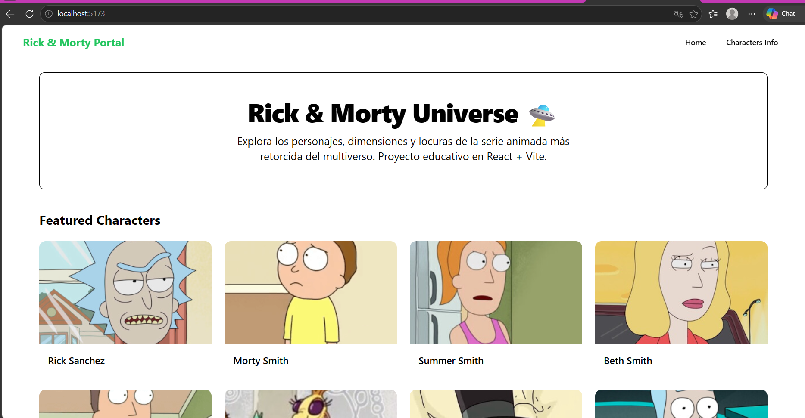
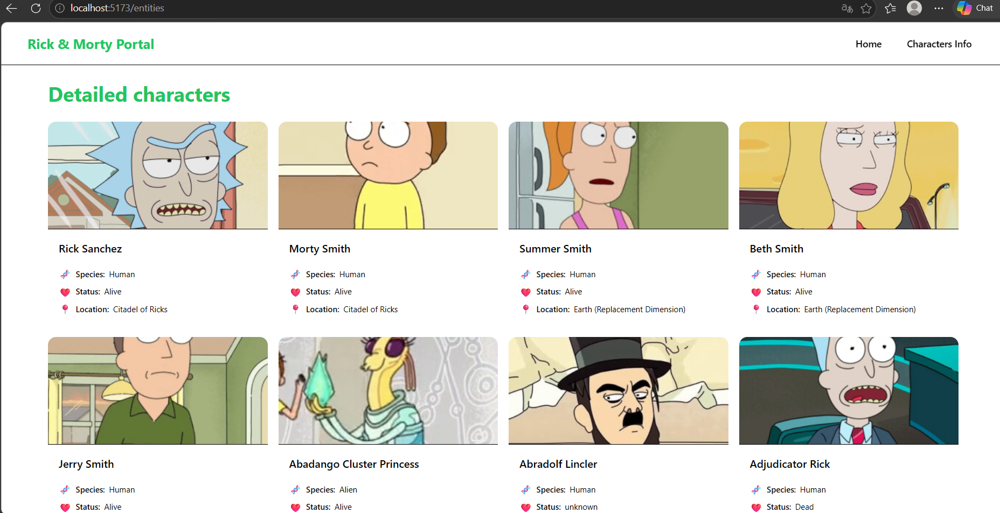

# 🛸 Rick & Morty Universe Portal

Pequeña aplicación web responsiva e interactiva construida con **React**, **TypeScript** y **Vite**, que consume datos en tiempo real desde la API pública de Rick & Morty. El proyecto cuenta con un sistema de rutas dinámico y componentes altamente estilizados implementados a través de **Shadcn UI** y **Tailwind CSS**.

---

## 📸 Capturas de Pantalla

### Vista Home (Ruta: `/`)

Contiene una sección Hero de bienvenida con el nombre, descripción del proyecto y un catálogo responsivo de los personajes destacados.



### Vista Entities (Ruta: `/entities`)

Catálogo compacto estructurado en formato de grilla (4 columnas en escritorio) que muestra las tarjetas detalladas con imágenes optimizadas y 3 propiedades obligatorias: Especie, Estado y Ubicación.



---

## 🛠️ Tecnologías Utilizadas

El proyecto fue desarrollado utilizando el stack moderno de desarrollo Frontend:

- **React 18** & **TypeScript**: Programación orientada a componentes con tipado estático estricto.
- **Vite**: Herramienta de construcción y empaquetado ultra rápida.
- **React Router Dom v6**: Enrutamiento declarativo para mantener una SPA (Single Page Application).
- **Tailwind CSS v3**: Framework de utilidades CSS para el maquetado visual.
- **Shadcn UI**: Componentes primitivos de interfaz accesibles y personalizables (`Card`, `Button`).

---

## ⚙️ Requisitos del Proyecto Cumplidos

- [x] **Configuración Inicial**: Estructura base limpia, alias de rutas (`@/*`) configurado en `tsconfig.json` y `vite.config.ts`.
- [x] **Consumo de API**: Conexión asíncrona nativa mediante `fetch` hacia `/api/character`.
- [x] **Ruta Home (`/`)**: Sección Hero descriptiva y catálogo inicial.
- [x] **Ruta Entities (`/entities`)**: Renderizado de tarjetas compactas con imágenes adaptadas y tres propiedades (`species`, `status`, `location.name`).
- [x] **Navegación**: Navbar global funcional con cambio de estado de rutas sin recarga de página.
- [x] **Estilos Shadcn UI**: Configuración global e inyección de temas basada en variables CSS.

---

## 📦 Pasos para Ejecutar el Servidor Local

Sigue estas instrucciones para clonar y levantar el entorno de desarrollo en tu máquina:

1.  **Clonar el repositorio:**

    ```bash
    git clone https://github.com/Ingaxgaramendi/rickmorty-react.git
    cd rickmorty-react
    ```

2.  **Instalar las dependencias del proyecto:**

    ```bash
    npm install
    ```

3.  **Iniciar el servidor de desarrollo de Vite:**

    ```bash
    npm run dev
    ```

    _Una vez iniciado, abre [http://localhost:5173](http://localhost:5173) en tu navegador._

4.  **Compilar para producción (Opcional):**
    ```bash
    npm run build
    ```

---

## 🔗 Enlaces del Proyecto

> ⚠️ **Nota:** Asegúrate de reemplazar los siguientes marcadores de posición con tus enlaces reales antes de la entrega final.

- **Despliegue en Producción (Deploy):** [Visita la aplicación en vivo aquí](PROYECTO_DESPLEGADO_EN_VERCEL_O_NETLIFY)
- **Video Demostrativo (YouTube):** [Mira el funcionamiento completo de 1-2 min](LINK_A_TU_VIDEO_DE_YOUTUBE)
